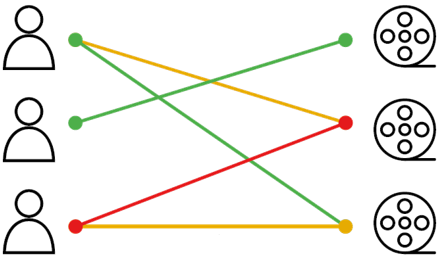
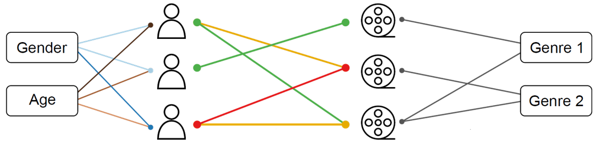
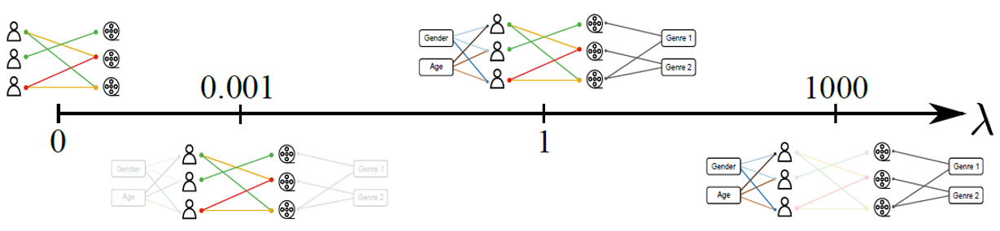

# Multipartite_MMSBM

Program to find the membership factors and the probabilities of connections in a bipartite network adding metadata to the nodes. This program finds the most plausible parameters of the Mixed-Membership Stochastic Block Model (MMSBM), that fits a dataset of links between nodes. Also you can add users' metadata that can help (or not) to the link prediction.
# Language
- Python >= 3.5

# Requirements
- pandas
- numpy
- numba
- PyYaml

# The link prediction problem and how we solve it

The problem that solves this program is the link prediction in a bipartite complex network where you have two types of nodes that can be users and items, politicians and bills... and labeled links that represents ratings, votes, preferences or simple connections.

The model that we use is Mixed-Membership Stochastic Block Model that supposes that nodes belongs to a superposition of groups and the probability of connection depends only of the groups that they belong (read [this][dc131834]).

  [dc131834]: https://www.pnas.org/doi/abs/10.1073/pnas.1606316113 "Accurate and scalable social recommendation using mixed-membership stochastic block models"



To get these model parameters we use an Bayesian inference approach to get the most plausible parameters, using the Maximum a Posteriori (MAP) algorithm.

Besides the known links, we can use the node attributes or metadata to improve or not the predictions. This improvement depends on the correlation of the metadata and the links.



In this case we extend our problem to a link prediction problem in a multipartite complex network where we have to take into account the metadata bipartites networks. Each metadata bipartite network is described using a MMSBM (read [this][f918b40b]).

  [f918b40b]: https://journals.aps.org/prx/pdf/10.1103/PhysRevX.12.011010 "Node Metadata Can Produce Predictability Crossovers in Network Inference Problems"

To adapt the algorithm to any situation where metadata is totally, partially or no correlated, our approach incorporates an hyperparameter _lambda_ to each metadata that informs about the importance of the metadata when are used.


## Program limitations

### Types of metadata
This program predicts links in a multipartite complex network. There are two types of metadata exclusive where each node is assigned to one type of metadata like gender, age, nationality... The second type is the inclusive type where each node can have more than one type of metadata. One example is the genre of a movie or any type of piece of art.

This program divides the two types of nodes as `users` and `items`. The `users` in this program can only have assigned exclusive metadata and `items` can only have assigned inclusive metadata.


### Values of _lambda_
As we said before, our approach is designed to tune the importance of **each** metadata, but the program was designed to tune separately the _lambda_ of the `users`' metadatas with the same value (`lambda_nodes`) and the `items`' metadatas with the same value (`lambda_items`).

# Configuration
When you want to perform an analysis, you have to create in the folder where the results will be stored a file named `config.yaml`. It has to be written in a yaml format with this structure:

```
folder: !!str Folder_directory

#Put {F} instead of the fold number
links:
    test: !!str formated_u{F}.test
    base: !!str formated_u{F}.base
    separator_base: !!str §
    separator_test: !!str \t
    rating_header: !!str rating

nodes:
    nodes_header: !!str userId
    nodes_meta:
    - metadata_id_1
    - metadata_id_2
    ...
    file: !!str formated_users_tmp2.dat
    K: !!int 10
    separator: !!str \t
    lambda_nodes: 0.01

items:
    items_meta:
    - metadata_id_1
    - metadata_id_2
    ...
    items_header: !!str movieId
    file: !!str formated_movies_tmp2.dat
    L: !!int 10
    separator: !!str \t
    lambda_items: 0.0
    Taus:
    - 10

seed: !!int 77777
N_fold: !!int 2

simulation:
    N_itt: !!int 3000
    N_measure: !!int 1
```
## `folder`
Directory where your dataset that you want to analyze is stored.

## `links`
Section where you have to put information about the file that contains the links:
- `test`: Filename of the test set file
- `base`: Filename of the base set file
- `separator_test` and `separator_base`: Separators of the test and base files (default `\t`)
- `rating_header`: Header of the rating column
If your filenames have a number referring to the fold, you can write `{F}` and the program will substitute it automatically for the fold number.

## `users`
Section where you put the information of your nodes metadata file
- `nodes_header`: Header of the nodes identification column
- `K`: Numbers of nodes groups
- `file`: Filename with nodes metadata's information
- `nodes_meta`: Vector with the name of all the  nodes' metadata headers'
- `separator`: Separators of the nodes' file (default `\t`)
- `lambda_items`: Intensity of nodes's priors

## `items`
Section where you put the information of your items metadata file
- `items_header`: Header of the items identification column
- `L`: Numbers of items groups
- `file`:Filename with items metadata's information
- `items_meta`: Vector with the name of all the  items' metadata headers'
- `separator`: Separators of the items' file (default `\t`)
- `lambda_items`: Intensity of items's priors
- `Taus`: Vector with the numbers of groups of items'

## `seed`
Integer with the seed that the algorithm will initialize the membership and probabilities matrices

## `simulation`
Information about the simulation procedure
- `N_itt` Number of iterationts
- `N_measure` Number of iterations of separation between convergence checking

# Files structure
To use the program you need, at less, the file that contains the links of the bipartite network that you want to infer. If you want to add metadata to the nodes or the items you need one file for each containing the information of each node/item. All files must be writed in columns. By default, the program reads the files using a tabulator (`\t`) as a separator. If you use another separator you can change it in the `config.yaml` file as detailed above. The information about nodes, items and metadata must be integers that starts from 0 and increase sequentially. Here an example of a file that contains links:

```
node_id item_id label_id
0   2   0
0   6   2
0   8   1
1   3   0
1   2   1
...

```
Note that the first row contains the headers that you can indicate in the `config.yaml`.

And here we have an example of metadata file, in this case, we add to the _item_id_ the _genre_id_ metadata.
```
item_id genre_id
0       2
1       2
2       3
3       0
4       4
5       0
6       0
7       0
8       1
9       4
10      4
11      1

```
# Usage
To run the program you have to go to the directory where the `config.yaml` is and run the code.

`python3 Algoritme_model_2.py [OPTIONS]`

## Description
- `--help`,`-h` display this help and exit
-  `-K` number of user's groups that the MMBSM algorithm will user
- `-L`number of item's groups that the MMBSM algorithm will user
- `--lambda_nodes` value of the user's metadata visibility
- `--lambda_items` value of the item's metadata visibility
- `--seed`, `-s` seed to generate the random matrices. It is optional and must be an integer.
- `-N`, `--N_itt` number maximum of iterations that the maximization-expectation algorithm will perform.
- ``-n``, ``--N_meas`` number of steps between each record of data of the likelihood evolution.
- `--Redo`, `-R` If it is True, it redo simulation if it was done before, else, if the simulation was done before the program automatically exits.
- `--N_simu` optional label to add to the directory where the output files will be stored. If ``None`` the seed will appear instead.
- `--dir_format` directory format, adding information about the lambdes (``lambdes``) or the groups number (``groups``).
- `-F`,``--Fold`` fold number that appears in the links' filename in case that a _k_-fold cross validation is being used.

**_NOTE_**: There are some parameters that can be initialized in the `config.yaml` and the console parameters like `K`. If a parameter is initialized in both places, the console parameters will have priority.

# Outputs

 Once the MAP algorithm starts, a directory to store the outputs files is created. The folder will be created in the same directory where the program was executed and has the following structure.

- `simu_ln_{lambda_nodes}_li_{lambda_items}/results_simu_s_{seed}_f_{Fold}`  
  if `--dir_format`=`lambdes`
- `simu_K_{K}_L_{L}/results_simu_s_{seed}_f_{Fold}`
  if `--dir_format`=``groups``

In this directory four different files will appear:
- `info_simus.info` file that contains information about the run: date, number of links, ...
- `log_evolution.dat` it contains the values of the log-likelihoods in each `N_meas` steps of the MAP algorithm.
- `theta.dat` matrix with the membership factors of each user. Rows are users and columns are groups.
- `eta.dat` matrix with the membership factors of each item. Rows are items and columns are groups.
- `pkl_{r}.dat` matrix with the probabilities connections between groups with label _r_. The program will generate a file for each link label.
- `qlT_{r}_{meta}.dat` matrix with the probabilities connections between groups of items and the attributes _meta_ label _r_. The program will generate a file for each attribute and for each label. Labels can be 0 (connected) and 1 (not connected).
- `zeta_{meta}.dat` matrix with the membership factors of each item's attribute _meta_. Rows are attribute types and columns are groups. The program will generate a file for each attribute.
- `q_ka_{meta}.dat` matrix with the membership factors of each user's attribute _meta_. Rows are attribute types and columns are groups. The program will generate a file for each attribute.
